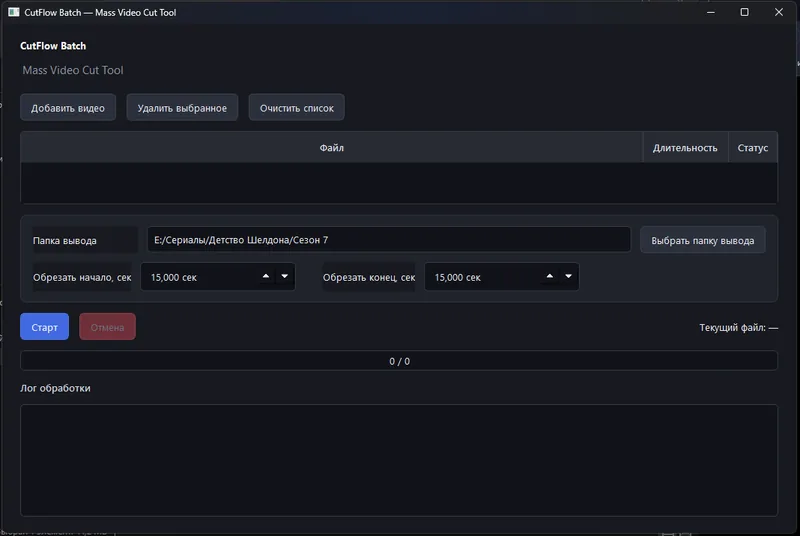

# CutFlow Batch

<p align="center">
  <strong>Mass Video Cut Tool for Windows</strong><br>
  Быстрая пакетная обрезка начала и конца видео с FFmpeg.
</p>

<p align="center">
  
  
  
  
  
</p>

CutFlow Batch — настольное приложение для Windows, которое позволяет одним заданием обрезать одинаковый фрагмент с начала и/или конца сразу у нескольких видео. Исходные файлы не изменяются.

Программа сначала пытается выполнить максимально быструю обрезку через **stream copy** (`-c copy`) без повторного кодирования. Если контейнер или набор потоков несовместим с таким режимом, CutFlow Batch автоматически повторяет обработку с перекодированием видео в **H.264** и аудио в **AAC**.

## Скриншот



## Возможности

- пакетная очередь видео;
- поддерживаемые входные расширения: `MP4`, `MKV`, `MOV`, `AVI`, `WebM`, `M4V`;
- независимая обрезка начала и конца файла;
- дробные значения времени с точностью до тысячных секунды;
- быстрый режим без перекодирования через FFmpeg `-c copy`;
- автоматический fallback: `libx264`, CRF 18, preset `veryfast`, AAC 192 kbit/s;
- автоматическое определение длительности через FFprobe;
- уникальные выходные имена: `name_cut.mp4`, `name_cut_1.mp4`, ...;
- защита от повторного добавления одного и того же файла в очередь;
- отдельный рабочий поток — интерфейс остаётся доступным во время обработки;
- отмена очереди с остановкой текущего процесса FFmpeg;
- статусы по каждому файлу и общий счётчик прогресса;
- подробный журнал обработки с временными метками;
- сохранение последней папки вывода и значений обрезки;
- тёмный интерфейс на PySide6;
- сборка standalone `CutFlowBatch.exe` через PyInstaller.

## Как работает обработка

Для каждого файла FFprobe получает исходную длительность:

```text
new_duration = original_duration - trim_start - trim_end
```

Если итоговая длительность меньше либо равна нулю, файл помечается как пропущенный. В остальных случаях используется следующий конвейер:

```text
Input video
   │
   ├─ FFprobe → duration
   │
   ├─ FFmpeg stream copy (-c copy)
   │       │
   │       ├─ success → output .mp4
   │       │
   │       └─ error
   │           ↓
   └─ FFmpeg transcode → H.264 + AAC → output .mp4
```

Ошибка одного файла не останавливает обработку остальных элементов очереди. Незавершённый выходной файл после ошибки или отмены удаляется.

> В fallback-режиме программа переносит видео- и аудиопотоки. Потоки, которые нельзя надёжно сохранить в MP4, например некоторые типы субтитров, в fallback-выход не включаются.

## Требования

- Windows 10 или Windows 11;
- Python 3.11+ для запуска из исходников;
- FFmpeg и FFprobe;
- Python-пакеты из `requirements.txt`.

Основные Python-зависимости:

```text
PySide6 >= 6.7, < 7
PyInstaller >= 6.8, < 7
```

## Быстрый старт из исходников

```bat
git clone https://github.com/kostiantynbryl/CutFlow-Batch.git
cd CutFlow-Batch
python -m pip install -r requirements.txt
python main.py
```

### FFmpeg

Программа ищет `ffmpeg.exe` и `ffprobe.exe` в таком порядке:

1. рядом с `main.py` или собранным `CutFlowBatch.exe`;
2. в системной переменной `PATH`.

Проверить доступность FFmpeg можно командами:

```bat
ffmpeg -version
ffprobe -version
```

FFmpeg можно получить с официальной страницы загрузки: <https://ffmpeg.org/download.html>.

## Использование

1. Нажмите **Добавить видео** и выберите один или несколько файлов.
2. При необходимости удалите отдельные строки или очистите очередь.
3. Выберите **Папку вывода**.
4. Укажите, сколько секунд удалить с начала.
5. Укажите, сколько секунд удалить с конца.
6. Нажмите **Старт**.
7. Следите за колонкой статуса, общим прогрессом и логом обработки.
8. Для остановки очереди нажмите **Отмена**.

По умолчанию выходные файлы сохраняются в папку `output` рядом с приложением.

Расширенная инструкция: [docs/USAGE.md](docs/USAGE.md).

## Сборка EXE

В корне проекта предусмотрен скрипт:

```bat
build_exe.bat
```

Он:

1. обновляет `pip`;
2. устанавливает зависимости;
3. запускает PyInstaller в режиме `--onefile --windowed`;
4. создаёт `dist\CutFlowBatch.exe`;
5. копирует локальные `ffmpeg.exe` и `ffprobe.exe` в `dist`, если они лежат в корне проекта.

Подробности: [docs/BUILDING.md](docs/BUILDING.md).

## Структура проекта

```text
CutFlow-Batch/
├── app/
│   ├── __init__.py
│   ├── ffmpeg_utils.py      # поиск FFmpeg/FFprobe и формирование команд
│   ├── gui.py               # интерфейс PySide6
│   ├── models.py            # модели очереди и итоговой статистики
│   ├── settings.py          # сохранение пользовательских настроек
│   └── video_processor.py   # очередь и выполнение FFmpeg
├── docs/
│   ├── screenshots/
│   │   └── main-window.webp
│   ├── BUILDING.md
│   ├── TROUBLESHOOTING.md
│   └── USAGE.md
├── build_exe.bat
├── CutFlowBatch.spec
├── main.py
├── requirements.txt
├── CHANGELOG.md
├── LICENSE
└── README.md
```

## Настройки

Приложение создаёт файл:

```text
cutflow_settings.json
```

В нём сохраняются:

- последняя папка вывода;
- значение обрезки начала;
- значение обрезки конца.

Файл является локальным runtime-файлом и исключён из Git.

## Диагностика

Если приложение не видит FFmpeg, не создаёт файл или обработка завершается ошибкой, см. [docs/TROUBLESHOOTING.md](docs/TROUBLESHOOTING.md).

## Документация

- [Использование](docs/USAGE.md)
- [Сборка Windows EXE](docs/BUILDING.md)
- [Устранение проблем](docs/TROUBLESHOOTING.md)
- [История изменений](CHANGELOG.md)

## Лицензия

Исходный код CutFlow Batch распространяется по лицензии [MIT](LICENSE).

FFmpeg, PySide6 и другие сторонние компоненты распространяются на условиях собственных лицензий и не становятся частью MIT-лицензии этого проекта.
